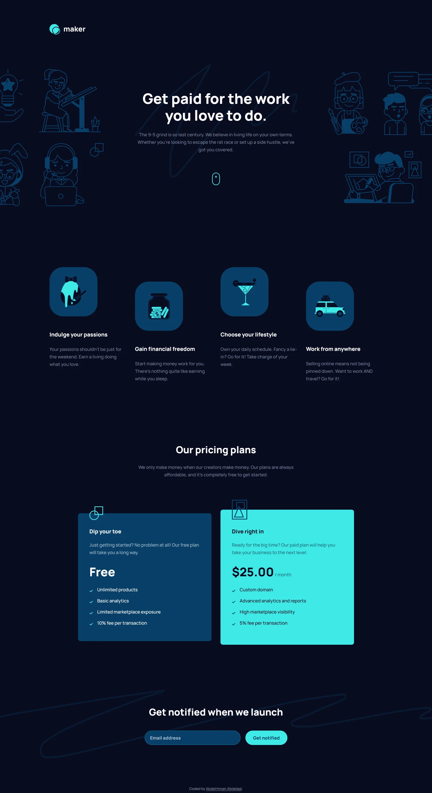

# maker pre-launch landing page

My solution to the [Maker pre-launch landing page](https://www.frontendmentor.io/challenges/maker-prelaunch-landing-page-WVZIJtKLd) challenge on Frontend Mentor.

- Live: https://maker-pre-launch-landing-page.abdelrhman-ahmed8881.workers.dev
- Code: https://github.com/MrBlackvanta/maker-pre-launch-landing-page

## Built with

- Next.js
- React
- TypeScript
- Tailwind CSS

## Author

- [LinkedIn](https://www.linkedin.com/in/abdelrhman-vanta/)
- [UpWork](https://www.upwork.com/freelancers/mrblackvanta)
- [Frontend Mentor](https://www.frontendmentor.io/profile/MrBlackvanta)
